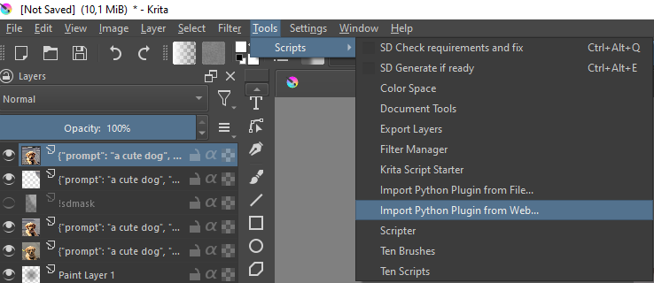
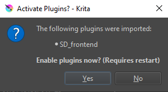
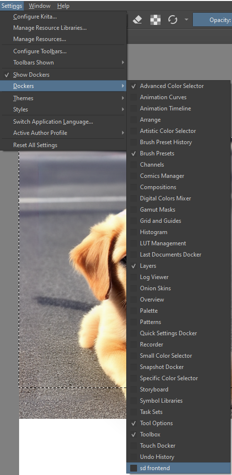

# Stable Diffusion Krita Front-End

A Docker Panel in Krita that can interface with [this Stable Diffusion WebUI host](https://github.com/AUTOMATIC1111/stable-diffusion-webui), so you can use all the amazing Stable Diffusion features you know and love from inside a real Digital Art Application!
* Text 2 Image
* Image 2 Image
* Inpainting
* Outpainting
* AI Upscaling
* Inside Krita, so:
    * __NO__ fuzzing around with the Inpainter Pen
    * __NO__ importing and exporting
    * __NO__ waiting for features to be ported to the plugin
    * __NO__ Context Switching because you needed a new batch of Images

 just generate your Vision.

#Installation

* __Copy this url to your clipboard:__ `https://github.com/internationalTD/sd_frontend/archive/refs/heads/main.zip`

* __Paste the link into Krita and activate the plugin__

    

    

* __Add the Docker__

    

* __Finally, Restart Krita__

#Usage

###Quick Test
To test the installation, we are going to create any size document, then an exactly 512x512 selection, and finally generate an output with Text2Image. Here is how to do that:

1. Press CTRL+ALT+E and follow instructions, if any.
2. Press CTRL+ALT+E and follow instructions, if any.
2. Press CTRL+ALT+E and follow instructions, if any.

###Beginner Tips

1. Use the requirement fixer hotkey <kbd>Ctrl</kbd>+<kbd>Alt</kbd>+<kbd>Q</kbd> to work fast:
    * hit __<kbd>CTRL</kbd>+<kbd>ALT</kbd>+<kbd>Q</kbd>__, then __Ctrl+R__ to switch to the Selection Tool and drag the edge to move the selection to where you want it.
    * hit __<kbd>CTRL</kbd>+<kbd>ALT</kbd>+<kbd>Q</kbd>__ in Inpainting Mode to make a new Inpainting Mask and activate the Brush tool with <kbd>B</kbd> to draw in it with white
    * make a rough selection and hit __<kbd>CTRL</kbd>+<kbd>ALT</kbd>+<kbd>Q</kbd>__ to make it divisible by 64, so Stable Diffusion can work without cropping or stretching.

2. You won't miss any important steps by just pressing generate, however

3. Generation settings are saved in the layers, press __any button marked ♻️__ to copy them into your docker. The one at the top copies __all settings__, _seed included_!
